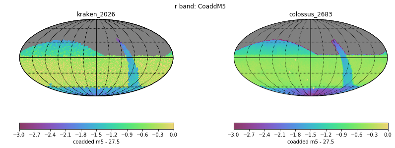

# Table of Contents
1. [fO](#fo)
2. [Total Effective Time](#total-effective-time)
3. [Normalized Effective Time](#normalized-effective-time)
4. [Open Shutter Fraction](#open-shutter-fraction)
5. [Parallax](#parallax)
6. [Proper Motion](#proper-motion)
7. [Rapid Revisit](#rapid-revisit)
8. [Fraction in Pairs](#fraction-in-paris)
9. [Slews](#slews)
10. [Filter Changes](#filter-changes)
11. [Nvisits](#nvisits)
12. [Proposal Fractions](#proposal-fractions)
13. [Median Nvisits WFD](#median-nvisits-wfd)
14. [Median CoaddM5 WFD](#median-coaddm5-wfd)
15. [Median FiveSigmaDepth](#median-fivesigmadepth)
16. [Median Internight Gap](#median-internight-gap)
17. [Median Airmass WFD](#median-airmass-wfd)
18. [Median Seeing WFD](#median-seeing-wfd)
19. [Skymap comparisons](#skymap-comparisons)
20. [Histogram comparisons](#histogram-comparisons)
# fO
|                                                       |   kraken_2026 |   colossus_2683 |
|:------------------------------------------------------|--------------:|----------------:|
| fOArea fO All visits HealpixSlicer                    |     18056.6   |       17020.9   |
| fOArea/benchmark fO All visits HealpixSlicer          |         1.003 |           0.946 |
| fONv MedianNvis fO All visits HealpixSlicer           |       940     |         877     |
| fONv MinNvis fO All visits HealpixSlicer              |       857     |         800     |
| fONv/benchmark MedianNvis fO All visits HealpixSlicer |         1.139 |           1.063 |
| fONv/benchmark MinNvis fO All visits HealpixSlicer    |         1.039 |           0.97  |
| fOArea fO WFD HealpixSlicer                           |     18040.6   |       16560.1   |
| fOArea/benchmark fO WFD HealpixSlicer                 |         1.002 |           0.92  |
| fONv MedianNvis fO WFD HealpixSlicer                  |       938     |         874     |
| fONv MinNvis fO WFD HealpixSlicer                     |       857     |         622     |
| fONv/benchmark MedianNvis fO WFD HealpixSlicer        |         1.137 |           1.059 |
| fONv/benchmark MinNvis fO WFD HealpixSlicer           |         1.039 |           0.754 |

# Total Effective Time
|                          |   kraken_2026 |   colossus_2683 |
|:-------------------------|--------------:|----------------:|
| Total Teff all bands     |   4.08386e+07 |     3.36076e+07 |
| Total Teff WFD all bands |   3.68931e+07 |     2.98389e+07 |

# Normalized Effective Time
|                                                    |   kraken_2026 |   colossus_2683 |
|:---------------------------------------------------|--------------:|----------------:|
| Median Normalized Teff WFD all bands HealpixSlicer |         0.584 |           0.607 |
| Normalized Teff WFD all bands HealpixSlicer        |     21495     |       23392     |
| Normalized Teff WFD all bands                      |         0.584 |           0.592 |

# Open Shutter Fraction
|                                                 |   kraken_2026 |   colossus_2683 |
|:------------------------------------------------|--------------:|----------------:|
| OpenShutterFraction All visits                  |         0.735 |           0.723 |
| Median OpenShutterFraction Per night OneDSlicer |         0.739 |           0.727 |
| OpenShutterFraction Per night OneDSlicer        |      3025     |        3015     |

# Parallax
|                                                                |   kraken_2026 |   colossus_2683 |
|:---------------------------------------------------------------|--------------:|----------------:|
| Median Parallax Error @ 22.4 All visits HealpixSlicer          |         1.816 |           1.899 |
| Median Parallax Error @ 24.0 All visits HealpixSlicer          |         7.066 |           7.466 |
| Median Parallax Coverage @ 22.4 All visits HealpixSlicer       |         0.555 |           0.592 |
| Median Parallax Coverage @ 24.0 All visits HealpixSlicer       |         0.551 |           0.584 |
| Median Parallax-DCR degeneracy @ 22.4 All visits HealpixSlicer |         0.237 |           0.215 |
| Median Parallax-DCR degeneracy @ 24.0 All visits HealpixSlicer |         0.235 |           0.211 |
| Median Parallax Error @ 22.4 WFD HealpixSlicer                 |         1.606 |           1.753 |
| Median Parallax Error @ 24.0 WFD HealpixSlicer                 |         6.175 |           6.808 |
| Median Parallax Coverage @ 22.4 WFD HealpixSlicer              |         0.559 |           0.604 |
| Median Parallax Coverage @ 24.0 WFD HealpixSlicer              |         0.555 |           0.598 |
| Median Parallax-DCR degeneracy @ 22.4 WFD HealpixSlicer        |         0.175 |           0.2   |
| Median Parallax-DCR degeneracy @ 24.0 WFD HealpixSlicer        |         0.172 |           0.195 |

# Proper Motion
|                                                            |   kraken_2026 |   colossus_2683 |
|:-----------------------------------------------------------|--------------:|----------------:|
| Median Proper Motion Error @ 20.5 All visits HealpixSlicer |         0.17  |           0.176 |
| Median Proper Motion Error @ 24.0 All visits HealpixSlicer |         1.813 |           1.944 |
| Median Proper Motion Error @ 20.5 WFD HealpixSlicer        |         0.166 |           0.172 |
| Median Proper Motion Error @ 24.0 WFD HealpixSlicer        |         1.677 |           1.842 |

# Rapid Revisit
|                                                      |   kraken_2026 |   colossus_2683 |
|:-----------------------------------------------------|--------------:|----------------:|
| Area (sq deg) RapidRevisits All visits HealpixSlicer |       10178   |         26241.4 |
| Median RapidRevisits All visits HealpixSlicer        |           0   |             1   |
| RapidRevisits All visits HealpixSlicer               |       31116   |         32092   |
| Area (sq deg) RapidRevisits WFD HealpixSlicer        |       10757.1 |         35188.1 |
| Median RapidRevisits WFD HealpixSlicer               |           0   |             1   |
| RapidRevisits WFD HealpixSlicer                      |       21495   |         23392   |

# Fraction in Pairs
|                                                                          |   kraken_2026 |   colossus_2683 |
|:-------------------------------------------------------------------------|--------------:|----------------:|
| Median Fraction of visits in pairs (15-60 min) gri HealpixSlicer         |         0.868 |           0.755 |
| Median Fraction of visits in pairs (15-60 min) gri WFD+NES HealpixSlicer |         0.876 |           0.768 |

# Slews
|                            |   kraken_2026 |   colossus_2683 |
|:---------------------------|--------------:|----------------:|
| Mean slewTime All visits   |         6.789 |           7.521 |
| Median slewTime All visits |         4.792 |           4.893 |
| Min slewTime All visits    |         2     |           2     |
| Max slewTime All visits    |       156     |         156     |

# Filter Changes
|                                                |   kraken_2026 |   colossus_2683 |
|:-----------------------------------------------|--------------:|----------------:|
| Filter Changes Whole Survey                    |     10813     |       29503     |
| Filter Changes Per Night OneDSlicer            |      3025     |        3015     |
| Max Filter Changes Per Night OneDSlicer        |        24     |          42     |
| Mean Filter Changes Per Night OneDSlicer       |         3.177 |           9.483 |
| Median Filter Changes Per Night OneDSlicer     |         2     |           9     |
| Min Filter Changes Per Night OneDSlicer        |         0     |           0     |
| N(+3Sigma) Filter Changes Per Night OneDSlicer |        68     |          34     |
| N(-3Sigma) Filter Changes Per Night OneDSlicer |         0     |           0     |
| Rms Filter Changes Per Night OneDSlicer        |         3.578 |           6.749 |

# Nvisits
|                                     |    kraken_2026 |   colossus_2683 |
|:------------------------------------|---------------:|----------------:|
| Fraction of total Nvisits All props |    1           |     1           |
| Nvisits All props                   |    2.43839e+06 |     2.00536e+06 |
| Median Nvisits All props OneDSlicer |  806           |   709           |
| Nvisits All props OneDSlicer        | 3025           |  3015           |

# Proposal Fractions
|                                                  |   kraken_2026 |   colossus_2683 |
|:-------------------------------------------------|--------------:|----------------:|
| Fraction of total Nvisits All props              |         1     |           1     |
| Fraction of total Nvisits SouthCelestialPole     |         0.02  |           0.029 |
| Fraction of total Nvisits NorthEclipticSpur      |         0.054 |           0.062 |
| Fraction of total Nvisits GalacticPlane          |         0.016 |           0.019 |
| Fraction of total Nvisits WFD                    |         0.864 |           0.838 |
| Fraction of total Nvisits DeepDrillingCosmology1 |         0.046 |           0.053 |
| Fraction of total Nvisits DD                     |         0.046 |           0.053 |
| Fraction of total Nvisits WideFastDeep           |         0.864 |           0.838 |

# Median Nvisits WFD
|                                            |   kraken_2026 |   colossus_2683 |
|:-------------------------------------------|--------------:|----------------:|
| Median NVisits WFD i band HealpixSlicer    |           204 |             185 |
| Median NVisits WFD g band HealpixSlicer    |            90 |              89 |
| Median NVisits WFD y band HealpixSlicer    |           188 |             180 |
| Median NVisits WFD u band HealpixSlicer    |            64 |              58 |
| Median NVisits WFD r band HealpixSlicer    |           206 |             186 |
| Median NVisits WFD z band HealpixSlicer    |           186 |             171 |
| Median NVisits WFD all bands HealpixSlicer |           938 |             869 |

# Median CoaddM5 WFD
|                                         |   kraken_2026 |   colossus_2683 |
|:----------------------------------------|--------------:|----------------:|
| Median CoaddM5 WFD i band HealpixSlicer |        26.618 |          26.552 |
| Median CoaddM5 WFD g band HealpixSlicer |        27.149 |          27.076 |
| Median CoaddM5 WFD y band HealpixSlicer |        24.906 |          24.868 |
| Median CoaddM5 WFD u band HealpixSlicer |        25.651 |          25.599 |
| Median CoaddM5 WFD r band HealpixSlicer |        27.201 |          27.075 |
| Median CoaddM5 WFD z band HealpixSlicer |        25.72  |          25.778 |

# Median FiveSigmaDepth
|                                                          |   kraken_2026 |   colossus_2683 |
|:---------------------------------------------------------|--------------:|----------------:|
| Median Median fiveSigmaDepth WFD i band HealpixSlicer    |        23.691 |          23.691 |
| Median Median fiveSigmaDepth WFD g band HealpixSlicer    |        24.646 |          24.609 |
| Median Median fiveSigmaDepth WFD y band HealpixSlicer    |        21.997 |          22.023 |
| Median Median fiveSigmaDepth WFD u band HealpixSlicer    |        23.337 |          23.346 |
| Median Median fiveSigmaDepth WFD r band HealpixSlicer    |        24.263 |          24.206 |
| Median Median fiveSigmaDepth WFD z band HealpixSlicer    |        22.783 |          22.942 |
| Median Median fiveSigmaDepth WFD all bands HealpixSlicer |        23.492 |          23.443 |

# Median Internight Gap
|                                                           |   kraken_2026 |   colossus_2683 |
|:----------------------------------------------------------|--------------:|----------------:|
| Median Median Inter-Night Gap WFD i band HealpixSlicer    |        10.957 |           7.044 |
| Median Median Inter-Night Gap WFD g band HealpixSlicer    |        25.858 |          17.009 |
| Median Median Inter-Night Gap WFD y band HealpixSlicer    |         3.962 |           7.946 |
| Median Median Inter-Night Gap WFD u band HealpixSlicer    |        23.959 |          27.904 |
| Median Median Inter-Night Gap WFD r band HealpixSlicer    |         7.941 |           7.436 |
| Median Median Inter-Night Gap WFD z band HealpixSlicer    |         5.994 |           9.003 |
| Median Median Inter-Night Gap WFD all bands HealpixSlicer |         1.956 |           1.993 |

# Median Airmass WFD
|                                                   |   kraken_2026 |   colossus_2683 |
|:--------------------------------------------------|--------------:|----------------:|
| Median Median airmass WFD i band HealpixSlicer    |         1.044 |           1.054 |
| Median Median airmass WFD g band HealpixSlicer    |         1.044 |           1.058 |
| Median Median airmass WFD y band HealpixSlicer    |         1.079 |           1.059 |
| Median Median airmass WFD u band HealpixSlicer    |         1.044 |           1.056 |
| Median Median airmass WFD r band HealpixSlicer    |         1.043 |           1.054 |
| Median Median airmass WFD z band HealpixSlicer    |         1.05  |           1.058 |
| Median Median airmass WFD all bands HealpixSlicer |         1.045 |           1.055 |

# Median Seeing WFD
|                                                     |   kraken_2026 |   colossus_2683 |
|:----------------------------------------------------|--------------:|----------------:|
| Median Median seeingEff WFD i band HealpixSlicer    |         0.827 |           0.824 |
| Median Median seeingEff WFD g band HealpixSlicer    |         0.891 |           0.898 |
| Median Median seeingEff WFD y band HealpixSlicer    |         0.805 |           0.798 |
| Median Median seeingEff WFD u band HealpixSlicer    |         0.945 |           0.925 |
| Median Median seeingEff WFD r band HealpixSlicer    |         0.854 |           0.858 |
| Median Median seeingEff WFD z band HealpixSlicer    |         0.811 |           0.81  |
| Median Median seeingEff WFD all bands HealpixSlicer |         0.836 |           0.834 |

# Skymap comparisons
- [Nvisits all bands](figures/colossus_2683_kraken_2026_NVisits_all_bands_HEAL_ComboSkyMap.pdf)

- [Nvisits alt/az all bands](figures/colossus_2683_kraken_2026_Nvisits_as_function_of_Alt_Az_all_bands_HEAL_ComboSkyMap.pdf)

- [Median airmass all bands](figures/colossus_2683_kraken_2026_Median_airmass_all_bands_HEAL_ComboSkyMap.pdf)

- [Max airmass all bands](figures/colossus_2683_kraken_2026_Max_airmass_all_bands_HEAL_ComboSkyMap.pdf)

- [CoaddM5 r band](figures/colossus_2683_kraken_2026_CoaddM5_r_band_HEAL_ComboSkyMap.pdf)

- [Normalized Proper Motion at 20.5](figures/colossus_2683_kraken_2026_Normalized_Proper_Motion_@_20_5_All_visits_HEAL_ComboSkyMap.pdf)

- [Normalized Parallax at 22.4](figures/colossus_2683_kraken_2026_Normalized_Parallax_@_22_4_All_visits_HEAL_ComboSkyMap.pdf)

# Histogram comparisons
### CoaddM5 r band HealPix Histogram

### Slew Distance Histogram

### Zoom Slew Distance Histogram

### Slew Time Histogram

### Zoom Slew Time Histogram 

