# Table of Contents
1. [fO](#fo)
2. [Total Effective Time](#total-effective-time)
3. [Normalized Effective Time](#normalized-effective-time)
4. [Open Shutter Fraction](#open-shutter-fraction)
5. [Parallax](#parallax)
6. [Proper Motion](#proper-motion)
7. [Rapid Revisit](#rapid-revisit)
8. [Fraction in Pairs](#fraction-in-paris)
9. [Slews](#slews)
10. [Filter Changes](#filter-changes)
11. [Nvisits](#nvisits)
12. [Proposal Fractions](#proposal-fractions)
13. [Median Nvisits WFD](#median-nvisits-wfd)
14. [Median CoaddM5 WFD](#median-coaddm5-wfd)
15. [Median FiveSigmaDepth](#median-fivesigmadepth)
16. [Median Internight Gap](#median-internight-gap)
17. [Median Airmass WFD](#median-airmass-wfd)
18. [Median Seeing WFD](#median-seeing-wfd)
19. [Skymap comparisons](#skymap-comparisons)
20. [Histogram comparisons](#histogram-comparisons)
# fO
|                                                       |   kraken_2026 |   pontus_2550 |
|:------------------------------------------------------|--------------:|--------------:|
| fOArea fO All visits HealpixSlicer                    |     18056.6   |     17971     |
| fOArea/benchmark fO All visits HealpixSlicer          |         1.003 |         0.998 |
| fONv MedianNvis fO All visits HealpixSlicer           |       940     |       901     |
| fONv MinNvis fO All visits HealpixSlicer              |       857     |       822     |
| fONv/benchmark MedianNvis fO All visits HealpixSlicer |         1.139 |         1.092 |
| fONv/benchmark MinNvis fO All visits HealpixSlicer    |         1.039 |         0.996 |
| fOArea fO WFD HealpixSlicer                           |     18040.6   |     17480     |
| fOArea/benchmark fO WFD HealpixSlicer                 |         1.002 |         0.971 |
| fONv MedianNvis fO WFD HealpixSlicer                  |       938     |       899     |
| fONv MinNvis fO WFD HealpixSlicer                     |       857     |       637     |
| fONv/benchmark MedianNvis fO WFD HealpixSlicer        |         1.137 |         1.09  |
| fONv/benchmark MinNvis fO WFD HealpixSlicer           |         1.039 |         0.772 |

# Total Effective Time
|                          |   kraken_2026 |   pontus_2550 |
|:-------------------------|--------------:|--------------:|
| Total Teff all bands     |   4.08386e+07 |   3.6503e+07  |
| Total Teff WFD all bands |   3.68931e+07 |   3.24296e+07 |

# Normalized Effective Time
|                                                    |   kraken_2026 |   pontus_2550 |
|:---------------------------------------------------|--------------:|--------------:|
| Median Normalized Teff WFD all bands HealpixSlicer |         0.584 |         0.639 |
| Normalized Teff WFD all bands HealpixSlicer        |     21495     |     23416     |
| Normalized Teff WFD all bands                      |         0.584 |         0.627 |

# Open Shutter Fraction
|                                                 |   kraken_2026 |   pontus_2550 |
|:------------------------------------------------|--------------:|--------------:|
| OpenShutterFraction All visits                  |         0.735 |         0.713 |
| Median OpenShutterFraction Per night OneDSlicer |         0.739 |         0.715 |
| OpenShutterFraction Per night OneDSlicer        |      3025     |      3013     |

# Parallax
|                                                                |   kraken_2026 |   pontus_2550 |
|:---------------------------------------------------------------|--------------:|--------------:|
| Median Parallax Error @ 22.4 All visits HealpixSlicer          |         1.816 |         1.812 |
| Median Parallax Error @ 24.0 All visits HealpixSlicer          |         7.066 |         7.078 |
| Median Parallax Coverage @ 22.4 All visits HealpixSlicer       |         0.555 |         0.591 |
| Median Parallax Coverage @ 24.0 All visits HealpixSlicer       |         0.551 |         0.585 |
| Median Parallax-DCR degeneracy @ 22.4 All visits HealpixSlicer |         0.237 |         0.24  |
| Median Parallax-DCR degeneracy @ 24.0 All visits HealpixSlicer |         0.235 |         0.239 |
| Median Parallax Error @ 22.4 WFD HealpixSlicer                 |         1.606 |         1.651 |
| Median Parallax Error @ 24.0 WFD HealpixSlicer                 |         6.175 |         6.364 |
| Median Parallax Coverage @ 22.4 WFD HealpixSlicer              |         0.559 |         0.608 |
| Median Parallax Coverage @ 24.0 WFD HealpixSlicer              |         0.555 |         0.603 |
| Median Parallax-DCR degeneracy @ 22.4 WFD HealpixSlicer        |         0.175 |         0.253 |
| Median Parallax-DCR degeneracy @ 24.0 WFD HealpixSlicer        |         0.172 |         0.253 |

# Proper Motion
|                                                            |   kraken_2026 |   pontus_2550 |
|:-----------------------------------------------------------|--------------:|--------------:|
| Median Proper Motion Error @ 20.5 All visits HealpixSlicer |         0.17  |         0.167 |
| Median Proper Motion Error @ 24.0 All visits HealpixSlicer |         1.813 |         1.755 |
| Median Proper Motion Error @ 20.5 WFD HealpixSlicer        |         0.166 |         0.163 |
| Median Proper Motion Error @ 24.0 WFD HealpixSlicer        |         1.677 |         1.658 |

# Rapid Revisit
|                                                      |   kraken_2026 |   pontus_2550 |
|:-----------------------------------------------------|--------------:|--------------:|
| Area (sq deg) RapidRevisits All visits HealpixSlicer |       10178   |       25004.2 |
| Median RapidRevisits All visits HealpixSlicer        |           0   |           1   |
| RapidRevisits All visits HealpixSlicer               |       31116   |       32091   |
| Area (sq deg) RapidRevisits WFD HealpixSlicer        |       10757.1 |       33429.1 |
| Median RapidRevisits WFD HealpixSlicer               |           0   |           1   |
| RapidRevisits WFD HealpixSlicer                      |       21495   |       23416   |

# Fraction in Pairs
|                                                                          |   kraken_2026 |   pontus_2550 |
|:-------------------------------------------------------------------------|--------------:|--------------:|
| Median Fraction of visits in pairs (15-60 min) gri HealpixSlicer         |         0.868 |         0.293 |
| Median Fraction of visits in pairs (15-60 min) gri WFD+NES HealpixSlicer |         0.876 |         0.312 |

# Slews
|                            |   kraken_2026 |   pontus_2550 |
|:---------------------------|--------------:|--------------:|
| Mean slewTime All visits   |         6.789 |         8.086 |
| Median slewTime All visits |         4.792 |         5.092 |
| Min slewTime All visits    |         2     |         2     |
| Max slewTime All visits    |       156     |       156     |

# Filter Changes
|                                                |   kraken_2026 |   pontus_2550 |
|:-----------------------------------------------|--------------:|--------------:|
| Filter Changes Whole Survey                    |     10813     |     29630     |
| Filter Changes Per Night OneDSlicer            |      3025     |      3013     |
| Max Filter Changes Per Night OneDSlicer        |        24     |        35     |
| Mean Filter Changes Per Night OneDSlicer       |         3.177 |         9.49  |
| Median Filter Changes Per Night OneDSlicer     |         2     |        10     |
| Min Filter Changes Per Night OneDSlicer        |         0     |         0     |
| N(+3Sigma) Filter Changes Per Night OneDSlicer |        68     |        17     |
| N(-3Sigma) Filter Changes Per Night OneDSlicer |         0     |         0     |
| Rms Filter Changes Per Night OneDSlicer        |         3.578 |         5.786 |

# Nvisits
|                                     |    kraken_2026 |    pontus_2550 |
|:------------------------------------|---------------:|---------------:|
| Fraction of total Nvisits All props |    1           |    1           |
| Nvisits All props                   |    2.43839e+06 |    2.04864e+06 |
| Median Nvisits All props OneDSlicer |  806           |  710           |
| Nvisits All props OneDSlicer        | 3025           | 3013           |

# Proposal Fractions
|                                                  |   kraken_2026 |   pontus_2550 |
|:-------------------------------------------------|--------------:|--------------:|
| Fraction of total Nvisits All props              |         1     |         1     |
| Fraction of total Nvisits SouthCelestialPole     |         0.02  |         0.027 |
| Fraction of total Nvisits NorthEclipticSpur      |         0.054 |         0.06  |
| Fraction of total Nvisits GalacticPlane          |         0.016 |         0.018 |
| Fraction of total Nvisits WFD                    |         0.864 |         0.841 |
| Fraction of total Nvisits DeepDrillingCosmology1 |         0.046 |         0.054 |
| Fraction of total Nvisits DD                     |         0.046 |         0.054 |
| Fraction of total Nvisits WideFastDeep           |         0.864 |         0.841 |

# Median Nvisits WFD
|                                            |   kraken_2026 |   pontus_2550 |
|:-------------------------------------------|--------------:|--------------:|
| Median NVisits WFD i band HealpixSlicer    |           204 |           195 |
| Median NVisits WFD g band HealpixSlicer    |            90 |            85 |
| Median NVisits WFD y band HealpixSlicer    |           188 |           181 |
| Median NVisits WFD u band HealpixSlicer    |            64 |            60 |
| Median NVisits WFD r band HealpixSlicer    |           206 |           195 |
| Median NVisits WFD z band HealpixSlicer    |           186 |           177 |
| Median NVisits WFD all bands HealpixSlicer |           938 |           894 |

# Median CoaddM5 WFD
|                                         |   kraken_2026 |   pontus_2550 |
|:----------------------------------------|--------------:|--------------:|
| Median CoaddM5 WFD i band HealpixSlicer |        26.618 |        26.601 |
| Median CoaddM5 WFD g band HealpixSlicer |        27.149 |        27.125 |
| Median CoaddM5 WFD y band HealpixSlicer |        24.906 |        24.881 |
| Median CoaddM5 WFD u band HealpixSlicer |        25.651 |        25.652 |
| Median CoaddM5 WFD r band HealpixSlicer |        27.201 |        27.157 |
| Median CoaddM5 WFD z band HealpixSlicer |        25.72  |        25.852 |

# Median FiveSigmaDepth
|                                                          |   kraken_2026 |   pontus_2550 |
|:---------------------------------------------------------|--------------:|--------------:|
| Median Median fiveSigmaDepth WFD i band HealpixSlicer    |        23.691 |        23.711 |
| Median Median fiveSigmaDepth WFD g band HealpixSlicer    |        24.646 |        24.692 |
| Median Median fiveSigmaDepth WFD y band HealpixSlicer    |        21.997 |        22.031 |
| Median Median fiveSigmaDepth WFD u band HealpixSlicer    |        23.337 |        23.383 |
| Median Median fiveSigmaDepth WFD r band HealpixSlicer    |        24.263 |        24.261 |
| Median Median fiveSigmaDepth WFD z band HealpixSlicer    |        22.783 |        23.01  |
| Median Median fiveSigmaDepth WFD all bands HealpixSlicer |        23.492 |        23.508 |

# Median Internight Gap
|                                                           |   kraken_2026 |   pontus_2550 |
|:----------------------------------------------------------|--------------:|--------------:|
| Median Median Inter-Night Gap WFD i band HealpixSlicer    |        10.957 |         7.983 |
| Median Median Inter-Night Gap WFD g band HealpixSlicer    |        25.858 |        20.967 |
| Median Median Inter-Night Gap WFD y band HealpixSlicer    |         3.962 |         6.99  |
| Median Median Inter-Night Gap WFD u band HealpixSlicer    |        23.959 |        27.444 |
| Median Median Inter-Night Gap WFD r band HealpixSlicer    |         7.941 |         7.013 |
| Median Median Inter-Night Gap WFD z band HealpixSlicer    |         5.994 |        10.016 |
| Median Median Inter-Night Gap WFD all bands HealpixSlicer |         1.956 |         1.975 |

# Median Airmass WFD
|                                                   |   kraken_2026 |   pontus_2550 |
|:--------------------------------------------------|--------------:|--------------:|
| Median Median airmass WFD i band HealpixSlicer    |         1.044 |         1.052 |
| Median Median airmass WFD g band HealpixSlicer    |         1.044 |         1.054 |
| Median Median airmass WFD y band HealpixSlicer    |         1.079 |         1.057 |
| Median Median airmass WFD u band HealpixSlicer    |         1.044 |         1.053 |
| Median Median airmass WFD r band HealpixSlicer    |         1.043 |         1.054 |
| Median Median airmass WFD z band HealpixSlicer    |         1.05  |         1.054 |
| Median Median airmass WFD all bands HealpixSlicer |         1.045 |         1.054 |

# Median Seeing WFD
|                                                     |   kraken_2026 |   pontus_2550 |
|:----------------------------------------------------|--------------:|--------------:|
| Median Median seeingEff WFD i band HealpixSlicer    |         0.827 |         0.833 |
| Median Median seeingEff WFD g band HealpixSlicer    |         0.891 |         0.872 |
| Median Median seeingEff WFD y band HealpixSlicer    |         0.805 |         0.795 |
| Median Median seeingEff WFD u band HealpixSlicer    |         0.945 |         0.901 |
| Median Median seeingEff WFD r band HealpixSlicer    |         0.854 |         0.851 |
| Median Median seeingEff WFD z band HealpixSlicer    |         0.811 |         0.81  |
| Median Median seeingEff WFD all bands HealpixSlicer |         0.836 |         0.83  |

# Skymap comparisons
- [Nvisits all bands](figures/kraken_2026_pontus_2550_NVisits_all_bands_HEAL_ComboSkyMap.pdf)
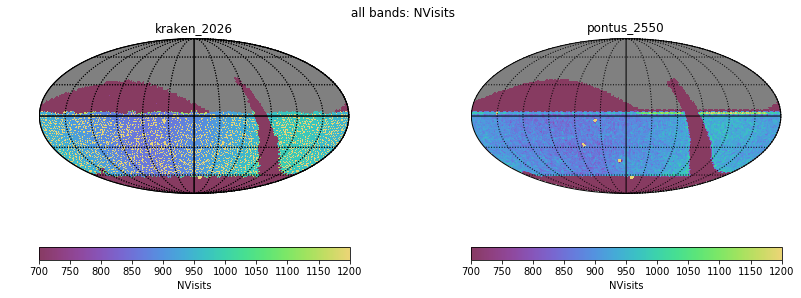
- [Nvisits alt/az all bands](figures/kraken_2026_pontus_2550_Nvisits_as_function_of_Alt_Az_all_bands_HEAL_ComboSkyMap.pdf)
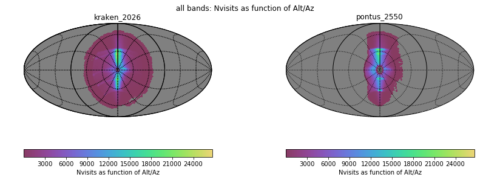
- [Median airmass all bands](figures/kraken_2026_pontus_2550_Median_airmass_all_bands_HEAL_ComboSkyMap.pdf)
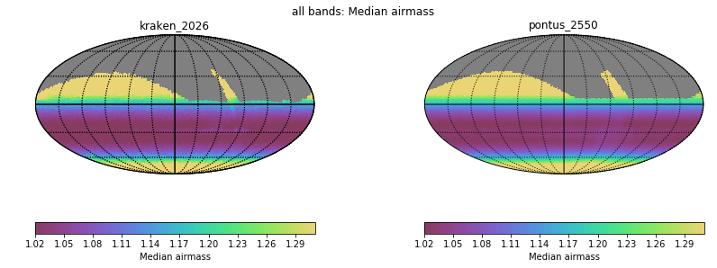
- [Max airmass all bands](figures/kraken_2026_pontus_2550_Max_airmass_all_bands_HEAL_ComboSkyMap.pdf)
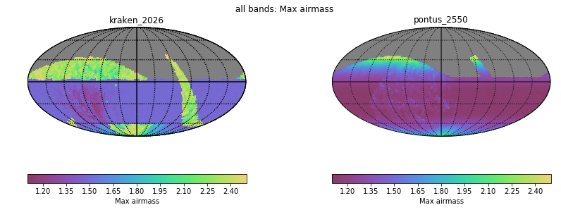
- [CoaddM5 r band](figures/kraken_2026_pontus_2550_CoaddM5_r_band_HEAL_ComboSkyMap.pdf)
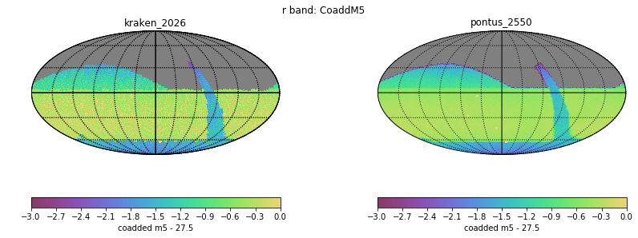
- [Normalized Proper Motion at 20.5](figures/kraken_2026_pontus_2550_Normalized_Proper_Motion_@_20_5_All_visits_HEAL_ComboSkyMap.pdf)
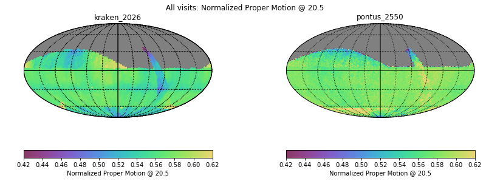
- [Normalized Parallax at 22.4](figures/kraken_2026_pontus_2550_Normalized_Parallax_@_22_4_All_visits_HEAL_ComboSkyMap.pdf)
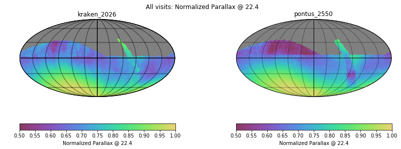
# Histogram comparisons
### CoaddM5 r band HealPix Histogram
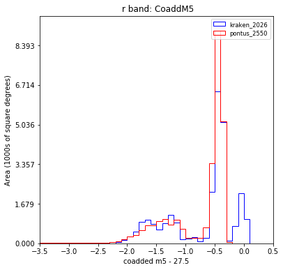
### Slew Distance Histogram
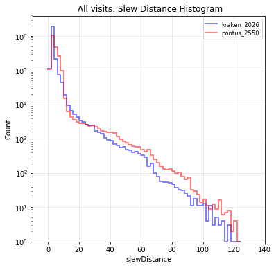
### Zoom Slew Distance Histogram
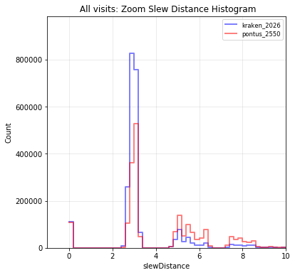
### Slew Time Histogram
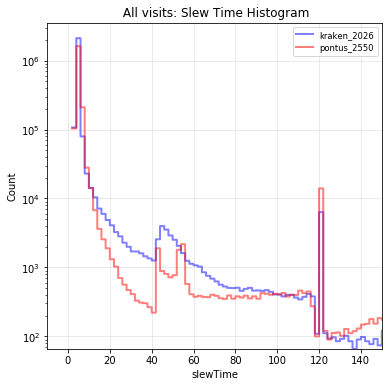
### Zoom Slew Time Histogram 
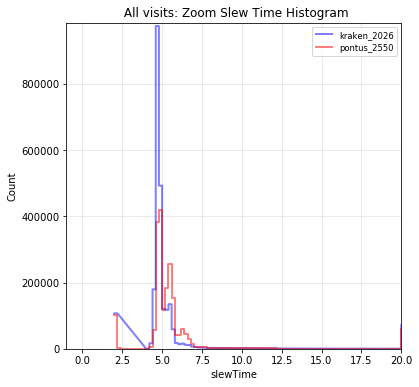
