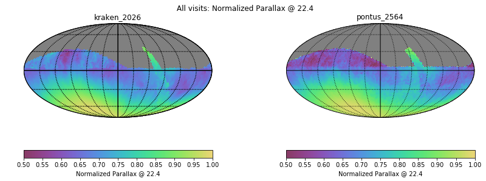
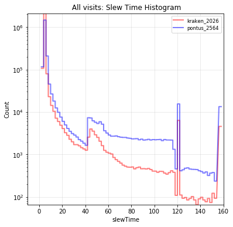

# Table of Contents
1. [fO](#fo)
2. [Total Effective Time](#total-effective-time)
3. [Normalized Effective Time](#normalized-effective-time)
4. [Open Shutter Fraction](#open-shutter-fraction)
5. [Parallax](#parallax)
6. [Proper Motion](#proper-motion)
7. [Rapid Revisit](#rapid-revisit)
8. [Fraction in Pairs](#fraction-in-pairs)
9. [Slews](#slews)
10. [Filter Changes](#filter-changes)
11. [Nvisits](#nvisits)
12. [Proposal Fractions](#proposal-fractions)
13. [Median Nvisits WFD](#median-nvisits-wfd)
14. [Median CoaddM5 WFD](#median-coaddm5-wfd)
15. [Median FiveSigmaDepth](#median-fivesigmadepth)
16. [Median Internight Gap](#median-internight-gap)
17. [Median Airmass WFD](#median-airmass-wfd)
18. [Median Seeing WFD](#median-seeing-wfd)
19. [Skymap comparisons](#skymap-comparisons)
20. [Histogram comparisons](#histogram-comparisons)

# fO
|                                                       |   kraken_2026 |   pontus_2564 |
|:------------------------------------------------------|--------------:|--------------:|
| fOArea fO All visits HealpixSlicer                    |     18056.6   |     17668.8   |
| fOArea/benchmark fO All visits HealpixSlicer          |         1.003 |         0.982 |
| fONv MedianNvis fO All visits HealpixSlicer           |       940     |       888     |
| fONv MinNvis fO All visits HealpixSlicer              |       857     |       777     |
| fONv/benchmark MedianNvis fO All visits HealpixSlicer |         1.139 |         1.076 |
| fONv/benchmark MinNvis fO All visits HealpixSlicer    |         1.039 |         0.942 |
| fOArea fO WFD HealpixSlicer                           |     18040.6   |     17226.5   |
| fOArea/benchmark fO WFD HealpixSlicer                 |         1.002 |         0.957 |
| fONv MedianNvis fO WFD HealpixSlicer                  |       938     |       887     |
| fONv MinNvis fO WFD HealpixSlicer                     |       857     |       583     |
| fONv/benchmark MedianNvis fO WFD HealpixSlicer        |         1.137 |         1.075 |
| fONv/benchmark MinNvis fO WFD HealpixSlicer           |         1.039 |         0.707 |

# Total Effective Time
|                          |   kraken_2026 |   pontus_2564 |
|:-------------------------|--------------:|--------------:|
| Total Teff all bands     |   4.08386e+07 |   3.26422e+07 |
| Total Teff WFD all bands |   3.68931e+07 |   2.82329e+07 |

# Normalized Effective Time
|                                                    |   kraken_2026 |   pontus_2564 |
|:---------------------------------------------------|--------------:|--------------:|
| Mean Normalized Teff WFD all bands HealpixSlicer   |         0.583 |         0.55  |
| Median Normalized Teff WFD all bands HealpixSlicer |         0.584 |         0.573 |
| Normalized Teff WFD all bands HealpixSlicer        |     21495     |     23381     |
| Normalized Teff WFD all bands                      |         0.584 |         0.556 |

# Open Shutter Fraction
|                                                 |   kraken_2026 |   pontus_2564 |
|:------------------------------------------------|--------------:|--------------:|
| OpenShutterFraction All visits                  |         0.735 |         0.655 |
| Mean OpenShutterFraction Per night OneDSlicer   |         0.735 |         0.658 |
| Median OpenShutterFraction Per night OneDSlicer |         0.739 |         0.667 |
| OpenShutterFraction Per night OneDSlicer        |      3025     |      3010     |

# Parallax
|                                                                |   kraken_2026 |   pontus_2564 |
|:---------------------------------------------------------------|--------------:|--------------:|
| Median Parallax Error @ 22.4 All visits HealpixSlicer          |         1.816 |         2.015 |
| Median Parallax Error @ 24.0 All visits HealpixSlicer          |         7.066 |         7.951 |
| Median Parallax Coverage @ 22.4 All visits HealpixSlicer       |         0.555 |         0.602 |
| Median Parallax Coverage @ 24.0 All visits HealpixSlicer       |         0.551 |         0.597 |
| Median Parallax-DCR degeneracy @ 22.4 All visits HealpixSlicer |         0.237 |         0.294 |
| Median Parallax-DCR degeneracy @ 24.0 All visits HealpixSlicer |         0.235 |         0.287 |
| Median Parallax Error @ 22.4 WFD HealpixSlicer                 |         1.606 |         1.89  |
| Median Parallax Error @ 24.0 WFD HealpixSlicer                 |         6.175 |         7.431 |
| Median Parallax Coverage @ 22.4 WFD HealpixSlicer              |         0.559 |         0.611 |
| Median Parallax Coverage @ 24.0 WFD HealpixSlicer              |         0.555 |         0.606 |
| Median Parallax-DCR degeneracy @ 22.4 WFD HealpixSlicer        |         0.175 |         0.281 |
| Median Parallax-DCR degeneracy @ 24.0 WFD HealpixSlicer        |         0.172 |         0.271 |

# Proper Motion
|                                                            |   kraken_2026 |   pontus_2564 |
|:-----------------------------------------------------------|--------------:|--------------:|
| Median Proper Motion Error @ 20.5 All visits HealpixSlicer |         0.17  |         0.18  |
| Median Proper Motion Error @ 24.0 All visits HealpixSlicer |         1.813 |         2.101 |
| Median Proper Motion Error @ 20.5 WFD HealpixSlicer        |         0.166 |         0.175 |
| Median Proper Motion Error @ 24.0 WFD HealpixSlicer        |         1.677 |         1.979 |

# Rapid Revisit
|                                                      |   kraken_2026 |   pontus_2564 |
|:-----------------------------------------------------|--------------:|--------------:|
| Area (sq deg) RapidRevisits All visits HealpixSlicer |     10178     |      16926.7  |
| Mean RapidRevisits All visits HealpixSlicer          |         0.247 |          0.41 |
| Median RapidRevisits All visits HealpixSlicer        |         0     |          0    |
| RapidRevisits All visits HealpixSlicer               |     31116     |      32073    |
| Area (sq deg) RapidRevisits WFD HealpixSlicer        |     10757.1   |      22688.2  |
| Mean RapidRevisits WFD HealpixSlicer                 |         0.261 |          0.55 |
| Median RapidRevisits WFD HealpixSlicer               |         0     |          1    |
| RapidRevisits WFD HealpixSlicer                      |     21495     |      23381    |

# Fraction in Pairs
|                                                                          |   kraken_2026 |   pontus_2564 |
|:-------------------------------------------------------------------------|--------------:|--------------:|
| Median Fraction of visits in pairs (15-60 min) gri HealpixSlicer         |         0.868 |         0.599 |
| Median Fraction of visits in pairs (15-60 min) gri WFD+NES HealpixSlicer |         0.876 |         0.617 |

# Slews
|                            |   kraken_2026 |   pontus_2564 |
|:---------------------------|--------------:|--------------:|
| Mean slewTime All visits   |         6.789 |        11.809 |
| Median slewTime All visits |         4.792 |         5.257 |

# Filter Changes
|                                            |   kraken_2026 |   pontus_2564 |
|:-------------------------------------------|--------------:|--------------:|
| Filter Changes Whole Survey                |     10813     |     28406     |
| Filter Changes Per Night OneDSlicer        |      3025     |      3010     |
| Mean Filter Changes Per Night OneDSlicer   |         3.177 |         8.914 |
| Median Filter Changes Per Night OneDSlicer |         2     |         9     |

# Nvisits
|                                     |    kraken_2026 |    pontus_2564 |
|:------------------------------------|---------------:|---------------:|
| Fraction of total Nvisits All props |    1           |    1           |
| Nvisits All props                   |    2.43839e+06 |    2.09597e+06 |
| Mean Nvisits All props OneDSlicer   |  806.079       |  696.336       |
| Median Nvisits All props OneDSlicer |  806           |  715           |
| Nvisits All props OneDSlicer        | 3025           | 3010           |

# Proposal Fractions
|                                                  |   kraken_2026 |   pontus_2564 |
|:-------------------------------------------------|--------------:|--------------:|
| Fraction of total Nvisits All props              |         1     |         1     |
| Fraction of total Nvisits SouthCelestialPole     |         0.02  |         0.041 |
| Fraction of total Nvisits NorthEclipticSpur      |         0.054 |         0.071 |
| Fraction of total Nvisits GalacticPlane          |         0.016 |         0.024 |
| Fraction of total Nvisits WFD                    |         0.864 |         0.807 |
| Fraction of total Nvisits DeepDrillingCosmology1 |         0.046 |         0.057 |
| Fraction of total Nvisits DD                     |         0.046 |         0.057 |
| Fraction of total Nvisits WideFastDeep           |         0.864 |         0.807 |

# Median Nvisits WFD
|                                            |   kraken_2026 |   pontus_2564 |
|:-------------------------------------------|--------------:|--------------:|
| Median NVisits WFD i band HealpixSlicer    |           204 |           148 |
| Median NVisits WFD g band HealpixSlicer    |            90 |           153 |
| Median NVisits WFD y band HealpixSlicer    |           188 |           185 |
| Median NVisits WFD u band HealpixSlicer    |            64 |            73 |
| Median NVisits WFD r band HealpixSlicer    |           206 |           164 |
| Median NVisits WFD z band HealpixSlicer    |           186 |           151 |
| Median NVisits WFD all bands HealpixSlicer |           938 |           883 |

# Median CoaddM5 WFD
|                                         |   kraken_2026 |   pontus_2564 |
|:----------------------------------------|--------------:|--------------:|
| Median CoaddM5 WFD i band HealpixSlicer |        26.618 |        26.275 |
| Median CoaddM5 WFD g band HealpixSlicer |        27.149 |        27.082 |
| Median CoaddM5 WFD y band HealpixSlicer |        24.906 |        24.925 |
| Median CoaddM5 WFD u band HealpixSlicer |        25.651 |        25.69  |
| Median CoaddM5 WFD r band HealpixSlicer |        27.201 |        26.938 |
| Median CoaddM5 WFD z band HealpixSlicer |        25.72  |        25.856 |

# Median FiveSigmaDepth
|                                                           |   kraken_2026 |   pontus_2564 |
|:----------------------------------------------------------|--------------:|--------------:|
| Median Median Inter-Night Gap WFD i band HealpixSlicer    |        10.957 |        12.957 |
| Median Median Inter-Night Gap WFD g band HealpixSlicer    |        25.858 |        13.863 |
| Median Median Inter-Night Gap WFD y band HealpixSlicer    |         3.962 |         7.51  |
| Median Median Inter-Night Gap WFD u band HealpixSlicer    |        23.959 |        22.419 |
| Median Median Inter-Night Gap WFD r band HealpixSlicer    |         7.941 |        11.922 |
| Median Median Inter-Night Gap WFD z band HealpixSlicer    |         5.994 |        12.944 |
| Median Median Inter-Night Gap WFD all bands HealpixSlicer |         1.956 |         2.964 |

# Median Internight Gap
|                                                          |   kraken_2026 |   pontus_2564 |
|:---------------------------------------------------------|--------------:|--------------:|
| Median Median fiveSigmaDepth WFD i band HealpixSlicer    |        23.691 |        23.507 |
| Median Median fiveSigmaDepth WFD g band HealpixSlicer    |        24.646 |        24.263 |
| Median Median fiveSigmaDepth WFD y band HealpixSlicer    |        21.997 |        22.067 |
| Median Median fiveSigmaDepth WFD u band HealpixSlicer    |        23.337 |        23.303 |
| Median Median fiveSigmaDepth WFD r band HealpixSlicer    |        24.263 |        24.13  |
| Median Median fiveSigmaDepth WFD z band HealpixSlicer    |        22.783 |        23.107 |
| Median Median fiveSigmaDepth WFD all bands HealpixSlicer |        23.492 |        23.298 |

# Median Airmass WFD
|                                                   |   kraken_2026 |   pontus_2564 |
|:--------------------------------------------------|--------------:|--------------:|
| Median Median airmass WFD i band HealpixSlicer    |         1.044 |         1.066 |
| Median Median airmass WFD g band HealpixSlicer    |         1.044 |         1.072 |
| Median Median airmass WFD y band HealpixSlicer    |         1.079 |         1.08  |
| Median Median airmass WFD u band HealpixSlicer    |         1.044 |         1.097 |
| Median Median airmass WFD r band HealpixSlicer    |         1.043 |         1.067 |
| Median Median airmass WFD z band HealpixSlicer    |         1.05  |         1.071 |
| Median Median airmass WFD all bands HealpixSlicer |         1.045 |         1.069 |

# Median Seeing WFD
|                                                     |   kraken_2026 |   pontus_2564 |
|:----------------------------------------------------|--------------:|--------------:|
| Median Median seeingEff WFD i band HealpixSlicer    |         0.827 |         0.837 |
| Median Median seeingEff WFD g band HealpixSlicer    |         0.891 |         0.919 |
| Median Median seeingEff WFD y band HealpixSlicer    |         0.805 |         0.798 |
| Median Median seeingEff WFD u band HealpixSlicer    |         0.945 |         0.958 |
| Median Median seeingEff WFD r band HealpixSlicer    |         0.854 |         0.868 |
| Median Median seeingEff WFD z band HealpixSlicer    |         0.811 |         0.809 |
| Median Median seeingEff WFD all bands HealpixSlicer |         0.836 |         0.848 |

# Skymap comparisons
- [Nvisits all bands](figures/kraken_2026_pontus_2564_NVisits_all_bands_HEAL_ComboSkyMap.pdf)

- [Nvisits alt/az all bands](figures/kraken_2026_pontus_2564_Nvisits_as_function_of_Alt_Az_all_bands_HEAL_ComboSkyMap.pdf)

- [Median airmass all bands](figures/kraken_2026_pontus_2564_Median_airmass_all_bands_HEAL_ComboSkyMap.pdf)

- [Max airmass all bands](figures/kraken_2026_pontus_2564_Max_airmass_all_bands_HEAL_ComboSkyMap.pdf)

- [CoaddM5 r band](figures/kraken_2026_pontus_2564_CoaddM5_r_band_HEAL_ComboSkyMap.pdf)

- [Normalized Proper Motion at 20.5](figures/kraken_2026_pontus_2564_Normalized_Proper_Motion_@_20_5_All_visits_HEAL_ComboSkyMap.pdf)

- [Normalized Parallax at 22.4](figures/kraken_2026_pontus_2564_Normalized_Parallax_@_22_4_All_visits_HEAL_ComboSkyMap.pdf)

# Histogram comparisons
### CoaddM5 r band HealPix Histogram

### Slew Distance Histogram

### Zoom Slew Distance Histogram

### Slew Time Histogram

### Zoom Slew Time Histogram 

