# Table of Contents
1. [fO](#fo)
2. [Total Effective Time](#total-effective-time)
3. [Normalized Effective Time](#normalized-effective-time)
4. [Open Shutter Fraction](#open-shutter-fraction)
5. [Parallax](#parallax)
6. [Proper Motion](#proper-motion)
7. [Rapid Revisit](#rapid-revisit)
8. [Fraction in Pairs](#fraction-in-pairs)
9. [Slews](#slews)
10. [Filter Changes](#filter-changes)
11. [Nvisits](#nvisits)
12. [Proposal Fractions](#proposal-fractions)
13. [Median Nvisits WFD](#median-nvisits-wfd)
14. [Median CoaddM5 WFD](#median-coaddm5-wfd)
15. [Median Airmass WFD](#median-airmass-wfd)
16. [Median Seeing WFD](#median-seeing-wfd)
17. [Skymap comparisons](#skymap-comparisons)
18. [Histrogram comparisons](#histrogram-comparisons)
# fO
|                                                       |   baseline2018a |   kraken_2028 |
|:------------------------------------------------------|----------------:|--------------:|
| fOArea: Nvisits (#) fO All visits HealpixSlicer       |         836     |       895     |
| fOArea: Nvisits/benchmark fO All visits HealpixSlicer |           1.013 |         1.085 |
| fONv: Area (sqdeg) fO All visits HealpixSlicer        |       18056.6   |     18040.6   |
| fONv: Area/benchmark fO All visits HealpixSlicer      |           1.003 |         1.002 |
| fOArea: Nvisits (#) fO WFD HealpixSlicer              |         835     |       895     |
| fOArea: Nvisits/benchmark fO WFD HealpixSlicer        |           1.012 |         1.085 |
| fONv: Area (sqdeg) fO WFD HealpixSlicer               |       18040.6   |     18040.6   |
| fONv: Area/benchmark fO WFD HealpixSlicer             |           1.002 |         1.002 |

# Total Effective Time
|                          |   baseline2018a |   kraken_2028 |
|:-------------------------|----------------:|--------------:|
| Total Teff all bands     |     3.9733e+07  |   4.65737e+07 |
| Total Teff WFD all bands |     3.59424e+07 |   4.52885e+07 |

# Normalized Effective Time
|                                                    |   baseline2018a |   kraken_2028 |
|:---------------------------------------------------|----------------:|--------------:|
| Normalized Teff WFD all bands                      |           0.585 |         0.667 |
| Median Normalized Teff WFD all bands HealpixSlicer |           0.584 |         0.659 |
| Normalized Teff WFD all bands HealpixSlicer        |       21495     |     21495     |

# Open Shutter Fraction
|                                                 |   baseline2018a |   kraken_2028 |
|:------------------------------------------------|----------------:|--------------:|
| OpenShutterFraction All visits                  |           0.716 |         0.718 |
| Median OpenShutterFraction Per night OneDSlicer |           0.718 |         0.734 |
| OpenShutterFraction Per night OneDSlicer        |        3025     |      3025     |

# Parallax
|                                                                |   baseline2018a |   kraken_2028 |
|:---------------------------------------------------------------|----------------:|--------------:|
| Median Parallax Error @ 22.4 All visits HealpixSlicer          |           1.849 |         1.901 |
| Median Parallax Error @ 24.0 All visits HealpixSlicer          |           7.212 |         7.445 |
| Median Parallax Coverage @ 22.4 All visits HealpixSlicer       |           0.548 |         0.557 |
| Median Parallax Coverage @ 24.0 All visits HealpixSlicer       |           0.541 |         0.553 |
| Median Parallax-DCR degeneracy @ 22.4 All visits HealpixSlicer |           0.219 |         0.199 |
| Median Parallax-DCR degeneracy @ 24.0 All visits HealpixSlicer |           0.214 |         0.197 |
| Median Parallax Error @ 22.4 WFD HealpixSlicer                 |           1.638 |         1.655 |
| Median Parallax Error @ 24.0 WFD HealpixSlicer                 |           6.32  |         6.407 |
| Median Parallax Coverage @ 22.4 WFD HealpixSlicer              |           0.549 |         0.564 |
| Median Parallax Coverage @ 24.0 WFD HealpixSlicer              |           0.544 |         0.561 |
| Median Parallax-DCR degeneracy @ 22.4 WFD HealpixSlicer        |           0.172 |         0.139 |
| Median Parallax-DCR degeneracy @ 24.0 WFD HealpixSlicer        |           0.165 |         0.134 |

# Proper Motion
|                                                            |   baseline2018a |   kraken_2028 |
|:-----------------------------------------------------------|----------------:|--------------:|
| Median Proper Motion Error @ 20.5 All visits HealpixSlicer |           0.173 |         0.174 |
| Median Proper Motion Error @ 24.0 All visits HealpixSlicer |           1.85  |         1.873 |
| Median Proper Motion Error @ 20.5 WFD HealpixSlicer        |           0.169 |         0.169 |
| Median Proper Motion Error @ 24.0 WFD HealpixSlicer        |           1.713 |         1.722 |

# Rapid Revisit
|                                                      |   baseline2018a |   kraken_2028 |
|:-----------------------------------------------------|----------------:|--------------:|
| Area (sq deg) RapidRevisits All visits HealpixSlicer |         9073.64 |       29889.7 |
| Median RapidRevisits All visits HealpixSlicer        |            0    |           1   |
| RapidRevisits All visits HealpixSlicer               |        31116    |       31116   |
| Area (sq deg) RapidRevisits WFD HealpixSlicer        |         9192.91 |       41253   |
| Median RapidRevisits WFD HealpixSlicer               |            0    |           1   |
| RapidRevisits WFD HealpixSlicer                      |        21495    |       21495   |

# Fraction in Pairs
|                                                                          |   baseline2018a |   kraken_2028 |
|:-------------------------------------------------------------------------|----------------:|--------------:|
| Median Fraction of visits in pairs (15-60 min) gri HealpixSlicer         |           0.895 |         0.924 |
| Median Fraction of visits in pairs (15-60 min) gri WFD+NES HealpixSlicer |           0.901 |         0.929 |

# Slews
|                            |   baseline2018a |   kraken_2028 |
|:---------------------------|----------------:|--------------:|
| Mean slewTime All visits   |           7.92  |         7.764 |
| Median slewTime All visits |           5.175 |         4.78  |
| Min slewTime All visits    |           2     |         2     |
| Max slewTime All visits    |         143     |       156     |

# Filter Changes
|                                                |   baseline2018a |   kraken_2028 |
|:-----------------------------------------------|----------------:|--------------:|
| Filter Changes Whole Survey                    |       10644     |      9005     |
| Filter Changes Per Night OneDSlicer            |        3025     |      3025     |
| Max Filter Changes Per Night OneDSlicer        |          23     |        22     |
| Mean Filter Changes Per Night OneDSlicer       |           3.135 |         2.583 |
| Median Filter Changes Per Night OneDSlicer     |           2     |         2     |
| Min Filter Changes Per Night OneDSlicer        |           0     |         0     |
| N(+3Sigma) Filter Changes Per Night OneDSlicer |          59     |        60     |
| N(-3Sigma) Filter Changes Per Night OneDSlicer |           0     |         0     |
| Rms Filter Changes Per Night OneDSlicer        |           3.471 |         2.656 |

# Nvisits
|                                     |   baseline2018a |    kraken_2028 |
|:------------------------------------|----------------:|---------------:|
| Fraction of total Nvisits All props |      1          |    1           |
| Nvisits All props                   |      2.3727e+06 |    2.38151e+06 |
| Median Nvisits All props OneDSlicer |    785          |  787           |
| Nvisits All props OneDSlicer        |   3025          | 3025           |

# Proposal Fractions
|                                              |   baseline2018a |   kraken_2028 |
|:---------------------------------------------|----------------:|--------------:|
| Fraction of total Nvisits All props          |           1     |         1     |
| Fraction of total Nvisits WFD                |           0.864 |         0.95  |
| Fraction of total Nvisits NorthEclipticSpur  |           0.055 |         0.027 |
| Fraction of total Nvisits WideFastDeep       |           0.864 |         0.493 |
| Fraction of total Nvisits GalacticPlane      |           0.016 |         0.009 |
| Fraction of total Nvisits SouthCelestialPole |           0.02  |         0.013 |

# Median Nvisits WFD
|                                            |   baseline2018a |   kraken_2028 |
|:-------------------------------------------|----------------:|--------------:|
| Median NVisits WFD y band HealpixSlicer    |             182 |           342 |
| Median NVisits WFD all bands HealpixSlicer |             912 |          1000 |
| Median NVisits WFD z band HealpixSlicer    |             183 |           160 |
| Median NVisits WFD i band HealpixSlicer    |             199 |           184 |
| Median NVisits WFD u band HealpixSlicer    |              62 |            55 |
| Median NVisits WFD r band HealpixSlicer    |             200 |           184 |
| Median NVisits WFD g band HealpixSlicer    |              87 |            78 |

# Median CoaddM5 WFD
|                                         |   baseline2018a |   kraken_2028 |
|:----------------------------------------|----------------:|--------------:|
| Median CoaddM5 WFD y band HealpixSlicer |          24.892 |        25.202 |
| Median CoaddM5 WFD z band HealpixSlicer |          25.707 |        25.944 |
| Median CoaddM5 WFD i band HealpixSlicer |          26.613 |        26.552 |
| Median CoaddM5 WFD u band HealpixSlicer |          25.615 |        25.536 |
| Median CoaddM5 WFD r band HealpixSlicer |          27.188 |        27.167 |
| Median CoaddM5 WFD g band HealpixSlicer |          27.11  |        27.088 |

# Median Airmass WFD
|                                                   |   baseline2018a |   kraken_2028 |
|:--------------------------------------------------|----------------:|--------------:|
| Median Median airmass WFD y band HealpixSlicer    |           1.079 |         1.09  |
| Median Median airmass WFD all bands HealpixSlicer |           1.048 |         1.044 |
| Median Median airmass WFD z band HealpixSlicer    |           1.057 |         1.042 |
| Median Median airmass WFD i band HealpixSlicer    |           1.05  |         1.045 |
| Median Median airmass WFD u band HealpixSlicer    |           1.044 |         1.043 |
| Median Median airmass WFD r band HealpixSlicer    |           1.045 |         1.042 |
| Median Median airmass WFD g band HealpixSlicer    |           1.046 |         1.043 |

# Median Seeing WFD
|                                                     |   baseline2018a |   kraken_2028 |
|:----------------------------------------------------|----------------:|--------------:|
| Median Median seeingEff WFD y band HealpixSlicer    |           0.806 |         0.823 |
| Median Median seeingEff WFD all bands HealpixSlicer |           0.836 |         0.835 |
| Median Median seeingEff WFD z band HealpixSlicer    |           0.816 |         0.794 |
| Median Median seeingEff WFD i band HealpixSlicer    |           0.823 |         0.827 |
| Median Median seeingEff WFD u band HealpixSlicer    |           0.956 |         0.954 |
| Median Median seeingEff WFD r band HealpixSlicer    |           0.849 |         0.848 |
| Median Median seeingEff WFD g band HealpixSlicer    |           0.906 |         0.893 |

# Skymap comparisons
- [Nvisits all bands](figures/kraken_2028_baseline2018a_NVisits_all_bands_HEAL_ComboSkyMap.pdf)
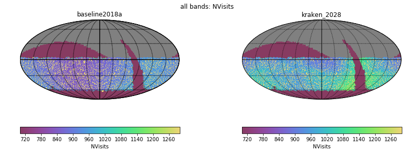
- [Nvisits alt/az all bands](figures/kraken_2028_baseline2018a_Nvisits_as_function_of_Alt_Az_all_bands_HEAL_ComboSkyMap.pdf)
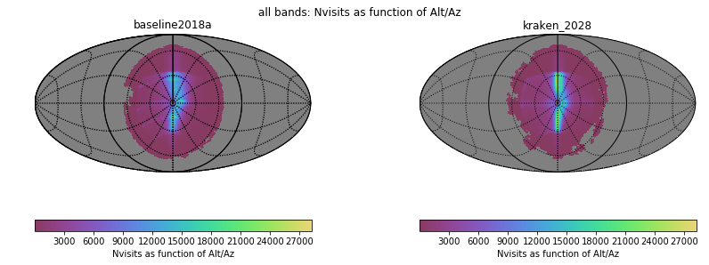
- [Median airmass all bands](figures/kraken_2028_baseline2018a_Median_airmass_all_bands_HEAL_ComboSkyMap.pdf)
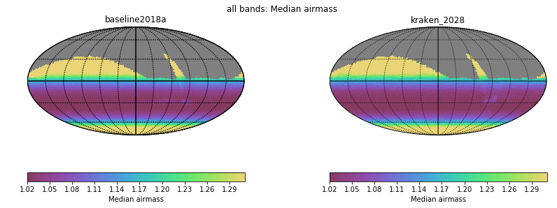
- [Max airmass all bands](figures/kraken_2028_baseline2018a_Max_airmass_all_bands_HEAL_ComboSkyMap.pdf)
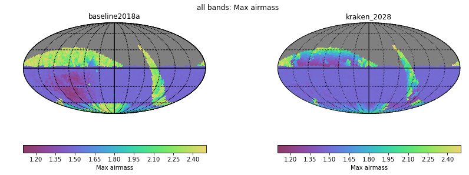
- [CoaddM5 r band](figures/kraken_2028_baseline2018a_CoaddM5_r_band_HEAL_ComboSkyMap.pdf)
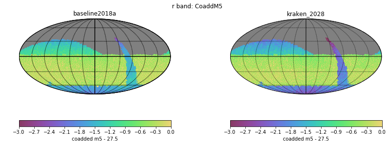
- [Normalized Proper Motion at 20.5](figures/kraken_2028_baseline2018a_Normalized_Proper_Motion_@_20_5_All_visits_HEAL_ComboSkyMap.pdf)
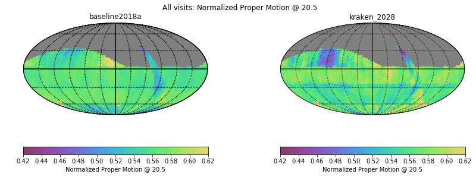
- [Normalized Parallax at 22.4](figures/kraken_2028_baseline2018a_Normalized_Parallax_@_22_4_All_visits_HEAL_ComboSkyMap.pdf)
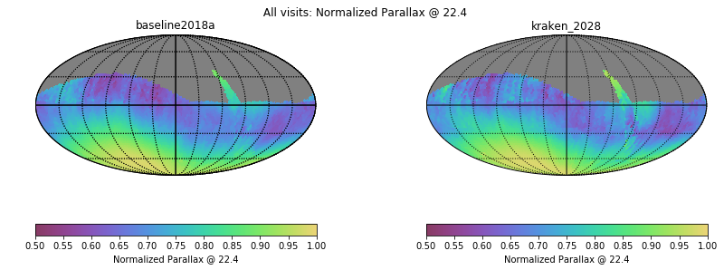
# Histrogram comparisons
### CoaddM5 r band HealPix Histrogram
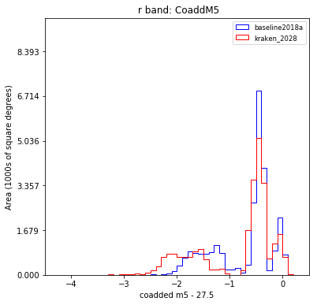
### Slew Distance Histogram
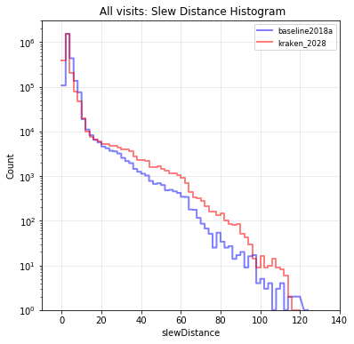
### Zoom Slew Distance Histogram
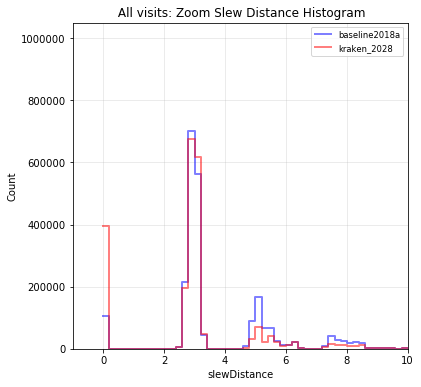
### Slew Time Histogram
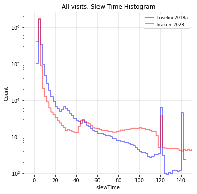
### Zoom Slew Time Histogram 
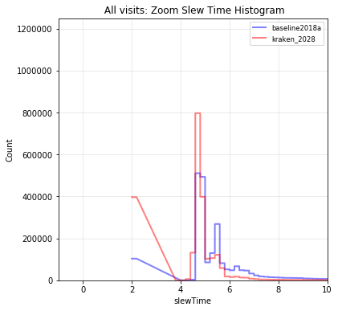
