# Table of Contents
1. [fO](#fo)
2. [Total Effective Time](#total-effective-time)
3. [Normalized Effective Time](#normalized-effective-time)
4. [Open Shutter Fraction](#open-shutter-fraction)
5. [Parallax](#parallax)
6. [Proper Motion](#proper-motion)
7. [Rapid Revisit](#rapid-revisit)
8. [Fraction in Pairs](#fraction-in-paris)
9. [Slews](#slews)
10. [Filter Changes](#filter-changes)
11. [Nvisits](#nvisits)
12. [Proposal Fractions](#proposal-fractions)
13. [Median Nvisits WFD](#median-nvisits-wfd)
14. [Median CoaddM5 WFD](#median-coaddm5-wfd)
15. [Median FiveSigmaDepth](#median-fivesigmadepth)
16. [Median Airmass WFD](#median-airmass-wfd)
17. [Median Seeing WFD](#median-seeing-wfd)
18. [Skymap comparisons](#skymap-comparisons)
19. [Histrogram comparisons](#histrogram-comparisons)
# fO
|                                                                            |   kraken_2026 |   kraken_2042 |
|:---------------------------------------------------------------------------|--------------:|--------------:|
| fOArea fO All visits RandomDitherPerNight HealpixSlicer                    |     17584     |     17708.3   |
| fOArea/benchmark fO All visits RandomDitherPerNight HealpixSlicer          |         0.977 |         0.984 |
| fONv MedianNvis fO All visits RandomDitherPerNight HealpixSlicer           |      1125     |      1203     |
| fONv MinNvis fO All visits RandomDitherPerNight HealpixSlicer              |       644     |       686     |
| fONv/benchmark MedianNvis fO All visits RandomDitherPerNight HealpixSlicer |         1.364 |         1.458 |
| fONv/benchmark MinNvis fO All visits RandomDitherPerNight HealpixSlicer    |         0.781 |         0.832 |
| fOArea fO WFD RandomDitherPerNight HealpixSlicer                           |     17422.9   |     17497.6   |
| fOArea/benchmark fO WFD RandomDitherPerNight HealpixSlicer                 |         0.968 |         0.972 |
| fONv MedianNvis fO WFD RandomDitherPerNight HealpixSlicer                  |      1123     |      1202     |
| fONv MinNvis fO WFD RandomDitherPerNight HealpixSlicer                     |       504     |       536     |
| fONv/benchmark MedianNvis fO WFD RandomDitherPerNight HealpixSlicer        |         1.361 |         1.457 |
| fONv/benchmark MinNvis fO WFD RandomDitherPerNight HealpixSlicer           |         0.611 |         0.65  |

# Total Effective Time
|                                               |   kraken_2026 |   kraken_2042 |
|:----------------------------------------------|--------------:|--------------:|
| Total Teff RandomDitherPerNight all bands     |   4.08386e+07 |   4.32732e+07 |
| Total Teff WFD RandomDitherPerNight all bands |   3.68931e+07 |   3.91593e+07 |

# Normalized Effective Time
|                                                                                          |   kraken_2026 |   kraken_2042 |
|:-----------------------------------------------------------------------------------------|--------------:|--------------:|
| Median Normalized Teff RandomDitherPerNight all bands RandomDitherPerNight HealpixSlicer |         0.539 |         0.532 |
| Normalized Teff RandomDitherPerNight all bands RandomDitherPerNight HealpixSlicer        |     32009     |     32026     |
| Normalized Teff RandomDitherPerNight all bands                                           |         0.558 |         0.553 |

# Open Shutter Fraction
|                                                 |   kraken_2026 |   kraken_2042 |
|:------------------------------------------------|--------------:|--------------:|
| OpenShutterFraction All visits                  |         0.735 |         0.787 |
| Median OpenShutterFraction Per night OneDSlicer |         0.739 |         0.792 |
| OpenShutterFraction Per night OneDSlicer        |      3025     |      3025     |

# Parallax
|                                                                                     |   kraken_2026 |   kraken_2042 |
|:------------------------------------------------------------------------------------|--------------:|--------------:|
| Median Parallax Error @ 22.4 All visits RandomDitherPerNight HealpixSlicer          |         1.721 |         1.67  |
| Median Parallax Error @ 24.0 All visits RandomDitherPerNight HealpixSlicer          |         6.718 |         6.523 |
| Median Parallax Coverage @ 22.4 All visits RandomDitherPerNight HealpixSlicer       |         0.556 |         0.57  |
| Median Parallax Coverage @ 24.0 All visits RandomDitherPerNight HealpixSlicer       |         0.552 |         0.564 |
| Median Parallax-DCR degeneracy @ 22.4 All visits RandomDitherPerNight HealpixSlicer |         0.245 |         0.257 |
| Median Parallax-DCR degeneracy @ 24.0 All visits RandomDitherPerNight HealpixSlicer |         0.244 |         0.255 |
| Median Parallax Error @ 22.4 WFD RandomDitherPerNight HealpixSlicer                 |         1.574 |         1.518 |
| Median Parallax Error @ 24.0 WFD RandomDitherPerNight HealpixSlicer                 |         6.108 |         5.88  |
| Median Parallax Coverage @ 22.4 WFD RandomDitherPerNight HealpixSlicer              |         0.559 |         0.572 |
| Median Parallax Coverage @ 24.0 WFD RandomDitherPerNight HealpixSlicer              |         0.555 |         0.567 |
| Median Parallax-DCR degeneracy @ 22.4 WFD RandomDitherPerNight HealpixSlicer        |         0.19  |         0.212 |
| Median Parallax-DCR degeneracy @ 24.0 WFD RandomDitherPerNight HealpixSlicer        |         0.187 |         0.211 |

# Proper Motion
|                                                                                 |   kraken_2026 |   kraken_2042 |
|:--------------------------------------------------------------------------------|--------------:|--------------:|
| Median Proper Motion Error @ 20.5 All visits RandomDitherPerNight HealpixSlicer |         0.156 |         0.151 |
| Median Proper Motion Error @ 24.0 All visits RandomDitherPerNight HealpixSlicer |         1.693 |         1.646 |
| Median Proper Motion Error @ 20.5 WFD RandomDitherPerNight HealpixSlicer        |         0.152 |         0.147 |
| Median Proper Motion Error @ 24.0 WFD RandomDitherPerNight HealpixSlicer        |         1.585 |         1.536 |

# Rapid Revisit
|                                                                           |   kraken_2026 |   kraken_2042 |
|:--------------------------------------------------------------------------|--------------:|--------------:|
| Area (sq deg) RapidRevisits All visits RandomDitherPerNight HealpixSlicer |       28024.8 |       28558.7 |
| Median RapidRevisits All visits RandomDitherPerNight HealpixSlicer        |           1   |           1   |
| RapidRevisits All visits RandomDitherPerNight HealpixSlicer               |       32009   |       32026   |
| Area (sq deg) RapidRevisits WFD RandomDitherPerNight HealpixSlicer        |       37688.9 |       37833.3 |
| Median RapidRevisits WFD RandomDitherPerNight HealpixSlicer               |           1   |           1   |
| RapidRevisits WFD RandomDitherPerNight HealpixSlicer                      |       22964   |       22969   |

# Fraction in Pairs
|                                                                                               |   kraken_2026 |   kraken_2042 |
|:----------------------------------------------------------------------------------------------|--------------:|--------------:|
| Median Fraction of visits in pairs (15-60 min) gri WFD+NES RandomDitherPerNight HealpixSlicer |         0.878 |         0.916 |
| Median Fraction of visits in pairs (15-60 min) gri RandomDitherPerNight HealpixSlicer         |         0.869 |         0.906 |

# Slews
|                            |   kraken_2026 |   kraken_2042 |
|:---------------------------|--------------:|--------------:|
| Mean slewTime All visits   |         6.789 |         7.117 |
| Median slewTime All visits |         4.792 |         4.805 |
| Min slewTime All visits    |         2     |         2     |
| Max slewTime All visits    |       156     |       156     |

# Filter Changes
|                                                |   kraken_2026 |   kraken_2042 |
|:-----------------------------------------------|--------------:|--------------:|
| Filter Changes Whole Survey                    |     10813     |     11402     |
| Filter Changes Per Night OneDSlicer            |      3025     |      3025     |
| Max Filter Changes Per Night OneDSlicer        |        24     |        26     |
| Mean Filter Changes Per Night OneDSlicer       |         3.177 |         3.361 |
| Median Filter Changes Per Night OneDSlicer     |         2     |         2     |
| Min Filter Changes Per Night OneDSlicer        |         0     |         0     |
| N(+3Sigma) Filter Changes Per Night OneDSlicer |        68     |        72     |
| N(-3Sigma) Filter Changes Per Night OneDSlicer |         0     |         0     |
| Rms Filter Changes Per Night OneDSlicer        |         3.578 |         3.853 |

# Nvisits
|                                     |    kraken_2026 |    kraken_2042 |
|:------------------------------------|---------------:|---------------:|
| Fraction of total Nvisits All props |    1           |    1           |
| Nvisits All props                   |    2.43839e+06 |    2.60937e+06 |
| Median Nvisits All props OneDSlicer |  806           |  862           |
| Nvisits All props OneDSlicer        | 3025           | 3025           |

# Proposal Fractions
|                                                  |   kraken_2026 |   kraken_2042 |
|:-------------------------------------------------|--------------:|--------------:|
| Fraction of total Nvisits All props              |         1     |         1     |
| Fraction of total Nvisits NorthEclipticSpur      |         0.054 |         0.055 |
| Fraction of total Nvisits SouthCelestialPole     |         0.02  |         0.019 |
| Fraction of total Nvisits WFD                    |         0.864 |         0.863 |
| Fraction of total Nvisits GalacticPlane          |         0.016 |         0.016 |
| Fraction of total Nvisits DeepDrillingCosmology1 |         0.046 |         0.048 |
| Fraction of total Nvisits DD                     |         0.046 |         0.048 |
| Fraction of total Nvisits WideFastDeep           |         0.864 |         0.863 |

# Median Nvisits WFD
|                                                                 |   kraken_2026 |   kraken_2042 |
|:----------------------------------------------------------------|--------------:|--------------:|
| Median NVisits WFD RandomDitherPerNight i band HealpixSlicer    |           242 |           261 |
| Median NVisits WFD RandomDitherPerNight y band HealpixSlicer    |           225 |           239 |
| Median NVisits WFD RandomDitherPerNight z band HealpixSlicer    |           223 |           239 |
| Median NVisits WFD RandomDitherPerNight u band HealpixSlicer    |            76 |            81 |
| Median NVisits WFD RandomDitherPerNight r band HealpixSlicer    |           243 |           262 |
| Median NVisits WFD RandomDitherPerNight all bands HealpixSlicer |          1117 |          1196 |
| Median NVisits WFD RandomDitherPerNight g band HealpixSlicer    |           106 |           113 |

# Median CoaddM5 WFD
|                                                              |   kraken_2026 |   kraken_2042 |
|:-------------------------------------------------------------|--------------:|--------------:|
| Median CoaddM5 WFD RandomDitherPerNight i band HealpixSlicer |        26.704 |        26.744 |
| Median CoaddM5 WFD RandomDitherPerNight y band HealpixSlicer |        24.972 |        25.005 |
| Median CoaddM5 WFD RandomDitherPerNight z band HealpixSlicer |        25.796 |        25.804 |
| Median CoaddM5 WFD RandomDitherPerNight u band HealpixSlicer |        25.727 |        25.744 |
| Median CoaddM5 WFD RandomDitherPerNight r band HealpixSlicer |        27.28  |        27.319 |
| Median CoaddM5 WFD RandomDitherPerNight g band HealpixSlicer |        27.224 |        27.251 |

# Median FiveSigmaDepth
|                                                                               |   kraken_2026 |   kraken_2042 |
|:------------------------------------------------------------------------------|--------------:|--------------:|
| Median Median fiveSigmaDepth WFD RandomDitherPerNight i band HealpixSlicer    |        23.689 |        23.687 |
| Median Median fiveSigmaDepth WFD RandomDitherPerNight y band HealpixSlicer    |        21.991 |        21.994 |
| Median Median fiveSigmaDepth WFD RandomDitherPerNight z band HealpixSlicer    |        22.78  |        22.766 |
| Median Median fiveSigmaDepth WFD RandomDitherPerNight u band HealpixSlicer    |        23.332 |        23.302 |
| Median Median fiveSigmaDepth WFD RandomDitherPerNight r band HealpixSlicer    |        24.26  |        24.263 |
| Median Median fiveSigmaDepth WFD RandomDitherPerNight all bands HealpixSlicer |        23.487 |        23.482 |
| Median Median fiveSigmaDepth WFD RandomDitherPerNight g band HealpixSlicer    |        24.642 |        24.64  |

# Median Airmass WFD
|                                                                        |   kraken_2026 |   kraken_2042 |
|:-----------------------------------------------------------------------|--------------:|--------------:|
| Median Median airmass WFD RandomDitherPerNight i band HealpixSlicer    |         1.051 |         1.051 |
| Median Median airmass WFD RandomDitherPerNight y band HealpixSlicer    |         1.086 |         1.086 |
| Median Median airmass WFD RandomDitherPerNight z band HealpixSlicer    |         1.054 |         1.059 |
| Median Median airmass WFD RandomDitherPerNight u band HealpixSlicer    |         1.05  |         1.051 |
| Median Median airmass WFD RandomDitherPerNight r band HealpixSlicer    |         1.049 |         1.049 |
| Median Median airmass WFD RandomDitherPerNight all bands HealpixSlicer |         1.052 |         1.053 |
| Median Median airmass WFD RandomDitherPerNight g band HealpixSlicer    |         1.049 |         1.05  |

# Median Seeing WFD
|                                                                          |   kraken_2026 |   kraken_2042 |
|:-------------------------------------------------------------------------|--------------:|--------------:|
| Median Median seeingEff WFD RandomDitherPerNight i band HealpixSlicer    |         0.828 |         0.826 |
| Median Median seeingEff WFD RandomDitherPerNight y band HealpixSlicer    |         0.807 |         0.807 |
| Median Median seeingEff WFD RandomDitherPerNight z band HealpixSlicer    |         0.813 |         0.815 |
| Median Median seeingEff WFD RandomDitherPerNight u band HealpixSlicer    |         0.946 |         0.968 |
| Median Median seeingEff WFD RandomDitherPerNight r band HealpixSlicer    |         0.854 |         0.851 |
| Median Median seeingEff WFD RandomDitherPerNight all bands HealpixSlicer |         0.837 |         0.838 |
| Median Median seeingEff WFD RandomDitherPerNight g band HealpixSlicer    |         0.893 |         0.895 |

# Skymap comparisons
- [Nvisits all bands](figures/kraken_2026_kraken_2042_NVisits_RandomDitherPerNight_all_bands_HEAL_ComboSkyMap.pdf)
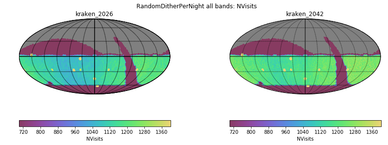
- [Nvisits alt/az all bands](figures/kraken_2026_kraken_2042_Nvisits_as_function_of_Alt_Az_all_bands_HEAL_ComboSkyMap.pdf)
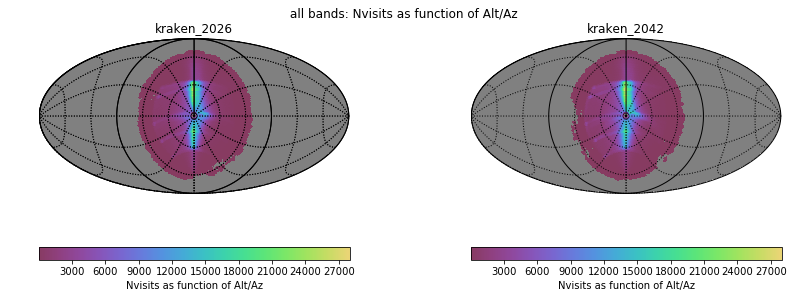
- [Median airmass all bands](figures/kraken_2026_kraken_2042_Median_airmass_RandomDitherPerNight_all_bands_HEAL_ComboSkyMap.pdf)
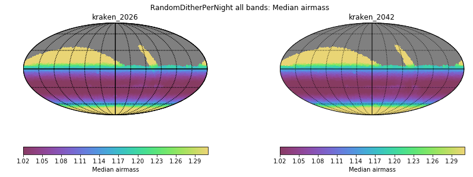
- [Max airmass all bands](figures/kraken_2026_kraken_2042_Max_airmass_RandomDitherPerNight_all_bands_HEAL_ComboSkyMap.pdf)
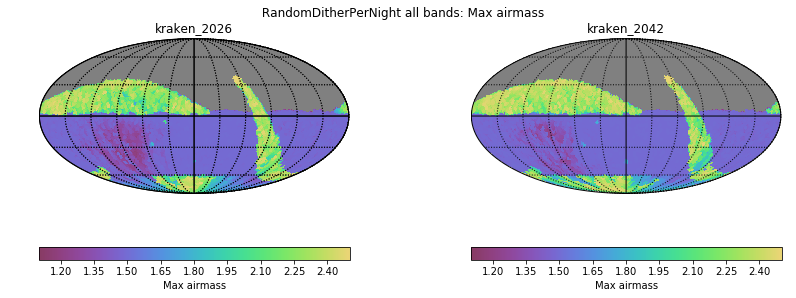
- [CoaddM5 r band](figures/kraken_2026_kraken_2042_CoaddM5_RandomDitherPerNight_r_band_HEAL_ComboSkyMap.pdf)
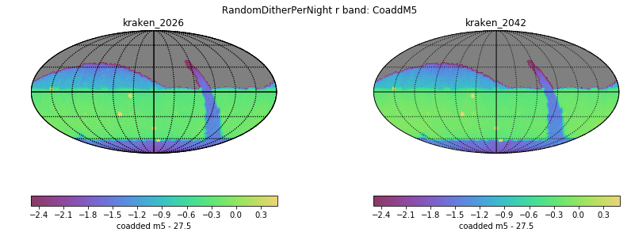
- [Median FiveSigmaDepth u band](figures/kraken_2026_kraken_2042_Median_fiveSigmaDepth_RandomDitherPerNight_u_band_HEAL_ComboSkyMap.pdf)
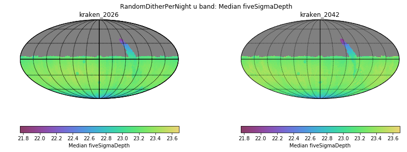
- [Normalized Proper Motion at 20.5](figures/kraken_2026_kraken_2042_Normalized_Proper_Motion_@_20_5_All_visits_RandomDitherPerNight_HEAL_ComboSkyMap.pdf)
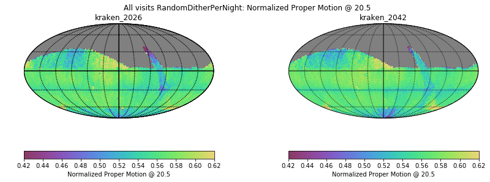
- [Normalized Parallax at 22.4](figures/kraken_2026_kraken_2042_Normalized_Parallax_@_22_4_All_visits_RandomDitherPerNight_HEAL_ComboSkyMap.pdf)
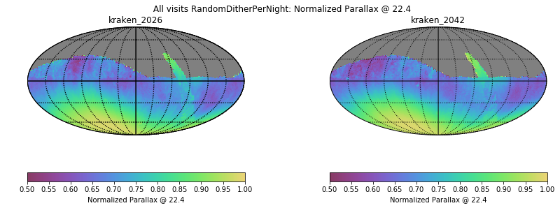
# Histrogram comparisons
### CoaddM5 r band HealPix Histogram
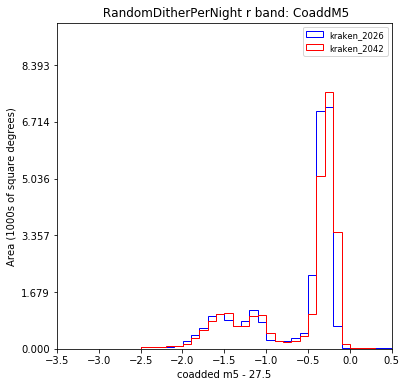
### Median FiveSigmaDepth u band HealPix Histogram
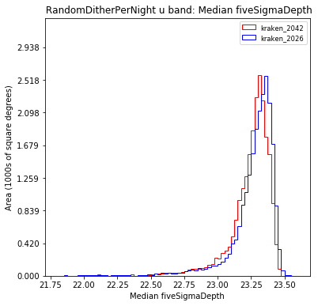
### Slew Distance Histogram
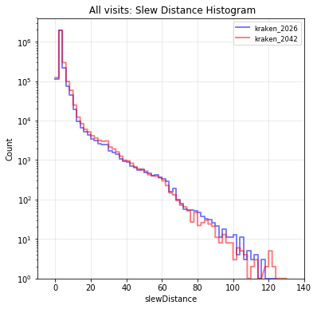
### Zoom Slew Distance Histogram
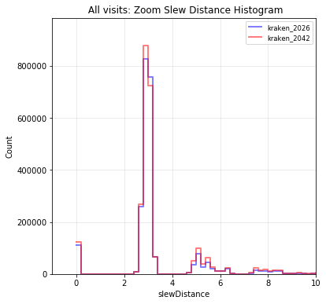
### Slew Time Histogram
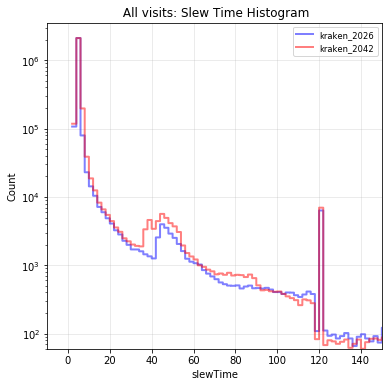
### Zoom Slew Time Histogram 
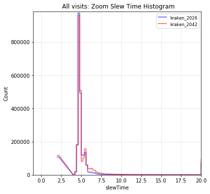
